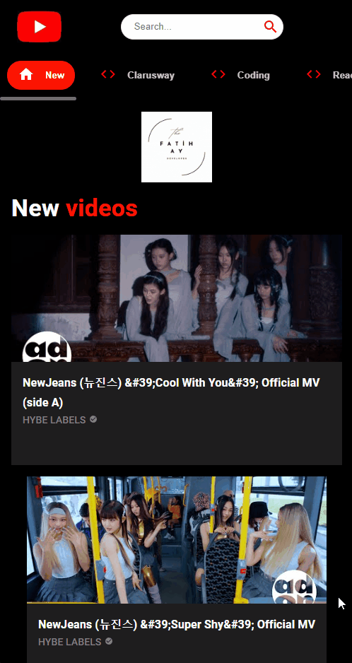

<h1>You<span style="color: red" >Tube</span>  Clone APP</h1> 

## Live Link: https://youtube-clone-app-fay.vercel.app/
## Description

The YouTube Clone App is a web application built to mimic the popular video-sharing platform, YouTube. This project serves as a foundation for creating a user-friendly and visually appealing platform where users can watch, share, and discover various videos.
## Features
- <span style="font-size: larger;">**Video Feed**</span>: The app provides a dynamic video feed that displays a collection of videos. Users can scroll through the feed to find intriguing content.
- <span style="font-size: larger;">**Video Details**</span>: Upon selecting a video from the feed, users can view the video's details, such as the title, description and view count.
- <span style="font-size: larger;">**Channel Pages**</span>: Each video is associated with a channel, and users can explore different channels to find content creators they enjoy.
- <span style="font-size: larger;">**Search Functionality**</span>: The app includes a powerful search bar that allows users to search for specific videos, channels, or content topics.
- <span style="font-size: larger;">**Loading Indicator**</span>: To enhance user experience during data fetching, the app includes a loading indicator that provides feedback when content is being loaded.
- <span style="font-size: larger;">**Responsive Design**</span>: The YouTube Clone App is designed to work seamlessly on various devices, including desktops, tablets, and mobile phones.


## Project Skeleton
```
.
├── LICENSE
├── README.md
├── package-lock.json
├── package.json
├── public
│   ├── favicon.ico
│   └── index.html
├── src
│   ├── App.js
│   ├── assets
│   │   ├── Fatih-Ay-1.png
│   │   ├── logo.gif
│   │   └── y1.jpg
│   ├── components
│   │   ├── ChannelCard.jsx
│   │   ├── ChannelDetail.jsx
│   │   ├── Feed.jsx
│   │   ├── Loader.jsx
│   │   ├── Navbar.jsx
│   │   ├── SearchBar.jsx
│   │   ├── SearchFeed.jsx
│   │   ├── Sidebar.jsx
│   │   ├── VideoCard.jsx
│   │   ├── VideoDetail.jsx
│   │   ├── Videos.jsx
│   │   └── index.js
│   ├── index.css
│   ├── index.js
│   └── utils
│       ├── constants.js
│       └── fetchFromAPI.js
└── youtube.gif
```

## Expected Outcomes
<div >


</div>

## Technologies and Libraries
- <span style="font-size: larger;">**React.js**</span>: A powerful JavaScript library for building interactive user interfaces.
- <span style="font-size: larger;">**Axios**</span>: A popular HTTP client for making API requests and handling responses.
- <span style="font-size: larger;">**React Router**</span>: A popular routing library for React applications, allowing for dynamic and intuitive navigation between different pages within the application.
- <span style="font-size: larger;">**Material UI**</span>: A popular React UI framework following Google's Material Design, offering customizable components for creating modern and responsive user interfaces with ease. Its pre-designed elements and consistent theming simplify UI development, making it a top choice for developers building intuitive web applications.
- <span style="font-size: larger;">**Rapid API**</span>: Rapid API enables developers to easily discover and access various APIs scattered across different service providers from a single place. This allows them to swiftly and with less complexity, retrieve data from different services or integrate specific functionalities into their applications.

## Getting Started

To run the application on your local machine, follow these steps:

1. Clone the project to your computer:

   ```
   git clone https://github.com/iamfatihay/youtube-clone-app.git
2. Open your terminal and navigate to the project directory.
   ```
   cd youtube-clone-app
3. Install the dependencies:
    ```
    npm install
4. Start the application:
    ```
    npm start
5. Open your web browser and visit  **http://localhost:3000**  to explore the Blog Application.

## Contribution
We welcome and encourage contributions to the YouTube Clone App! If you would like to contribute to the project, please follow these steps:

- Fork the repository on GitHub.
- Create a new branch for your feature or bug fix.
- Make your changes, ensuring that the code adheres to the project's coding standards.
- Write appropriate tests for the new features or bug fixes.
- Commit your changes with clear and descriptive commit messages.
- Push your branch to your forked repository.
- Open a pull request against the main repository, detailing the changes you have made.

## License

The Blog Application is licensed under the [MIT License](LICENSE). Feel free to use, modify, and distribute the code as per the terms of the license.